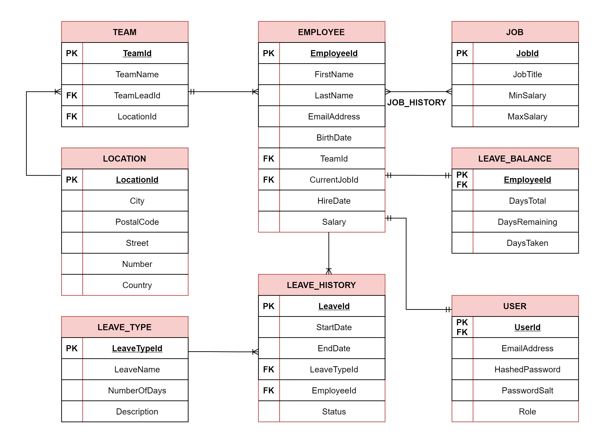

# HR-Web-Application
web application development project using ASP.NET 6

## Cerinte

1. Frontend (4p):
- [X] Cel putin 3 componente. Existenta rutelor (0.5 p)
- [X] Cel putin 3 servicii conectate la server (1p)
- [X] Cel putin 2 formulare (0.5 p)
- [X] Implementarea metodelor de comunicare intre componente (0.5p)
- [X] Cel putin 1 directiva (0.25p)
- [X] Cel putin 1 pipe (0.25p)
- [X] Register, Login, Implementare Guard (1p)
 
2. Backend (4p) :
- [X] 3 Controllere, Fiecare Metoda Crud cu date din baza de date (1p)
- [X] Cel puțin 1 relație între tabele din fiecare fel (1p)
- [X] Autentificare, Roluri; Cel putin 2 Roluri: Admin, User (1p)
- [X] Sa se foloseasca repository pattern, unit of work. (1p)
